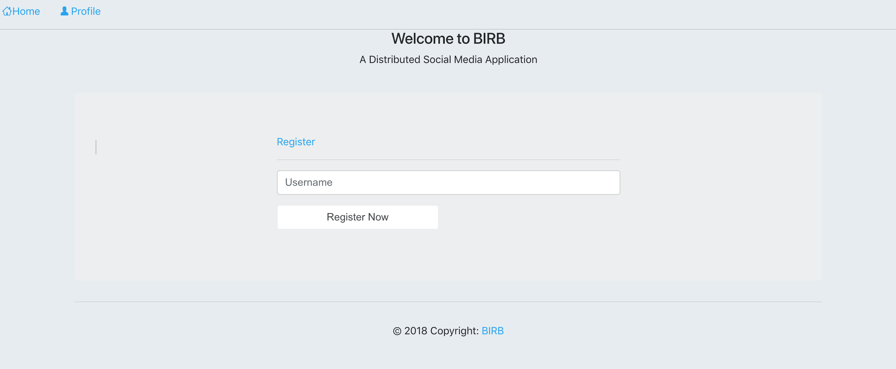
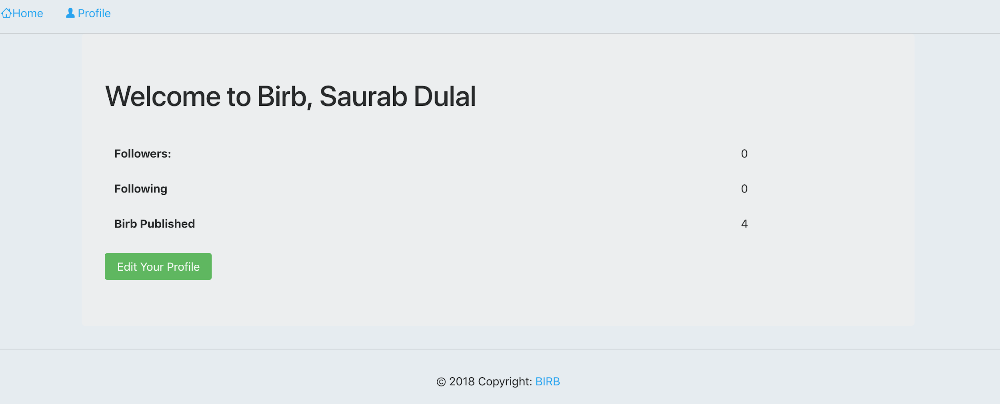
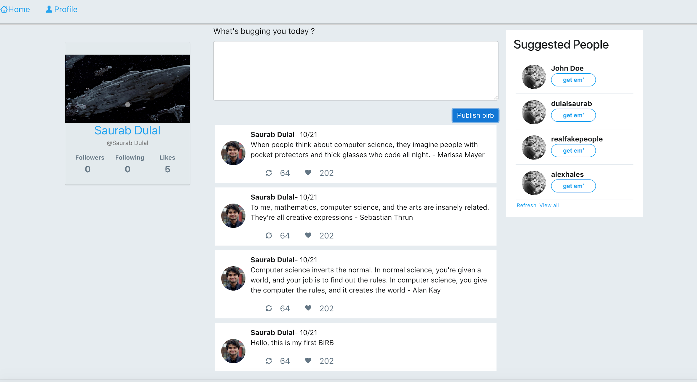

## BIRB: A Distributed Social Media Application Using NDN

**Requirements**

**Major Requirements**

* [Named Data Networking Forwarding Daemon ](https://github.com/named-data/NFD)[NFD](https://github.com/named-data/NFD)
* [Electron js](https://electronjs.org/)
* [Node.js](https://nodejs.org/)
* [ndn-js ](https://github.com/named-data/ndn-js)
* [electron-db](https://www.npmjs.com/package/electron-db) 
* Active Internet Connection

**Other Requirements**

* [Bootstrap V4](https://getbootstrap.com/)
* [Jquery (V >= 3.2)](https://code.jquery.com/jquery/)  
* [ShellJS - Unix shell commands for Node.js](https://github.com/shelljs/shelljs)

**Installation Process**

Before executing the application, all the major requirements needs to be installed properly

1. Installing NFD	

   * Well-documented installation guides are available on the following links
   * [Getting Started With NFD](https://named-data.net/doc/NFD/current/INSTALL.html) 
   * [http://named-data.net/doc/NFD/current/INSTALL.html](http://named-data.net/doc/NFD/current/INSTALL.html)
   * Once you install NFD correctly you can test it using following few commands
   * nfd-start  - to start NFD, nfd-stop - to kill NFD, nfdc status, nfdc fib, nfdc routes
   * **IMPORTANT**: NFD is required to execute the application, it should be up and running

2. Installing Node and Electron

* **Installing Node**
    * node is required to execute .js file in local env
        * e.g. node xyz.js
    * Node installation guide for MAC: [https://nodejs.org/en/download/](https://nodejs.org/en/download/)
    * Node installation guide for Linux: [https://nodejs.org/en/download/package-manager/#debian-and-ubuntu-based-linux-distributions](https://nodejs.org/en/download/package-manager/#debian-and-ubuntu-based-linux-distributions)
        * Note: apt-get install old version of node, make sure to follow the instruction above.

* **Installing Electron**
    * Follow the Github Instruction to install electro [https://github.com/electron/electron-api-demos/blob/master/README.md](https://github.com/electron/electron-api-demos/blob/master/README.md)

* **Installing ndn-js**
    * Download [ndn-js](https://github.com/named-data/ndn-js) from [https://github.com/named-data/ndn-js](https://github.com/named-data/ndn-js)
    * Have it somewhere on the desktop, better inside the application folder itself. We will use its path on the application

3. **Installing the APP BIRB**

   * Unzip the folder BIRB-master.zip or 
   * $ git clone https://github.com/dulalsaurab/BIRB.git
   * $ cd BIRB
   * Open "./lib/nfd_operations.js" file and provide the path of ndn-js (downloaded above) on path variable “path-ndn”
   * $ npm install
   * $ npm start

**Screenshots**

**4. References**

[1] [https://github.com/named-data/NFD](https://github.com/named-data/NFD)  
[2] [https://named-data.net/](https://named-data.net/)  
[3] [https://github.com/named-data/ndn-js](https://github.com/named-data/ndn-js)  
[4] [https://electronjs.org/](https://electronjs.org/)   
[5] [https://github.com/jvadillo/twitter-bootstrap](https://github.com/jvadillo/twitter-bootstrap)   

